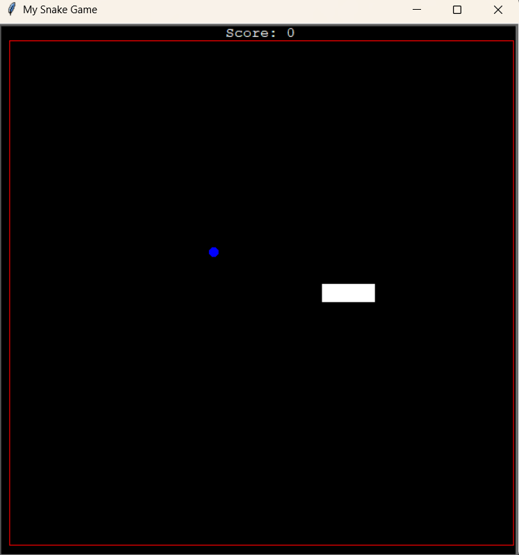
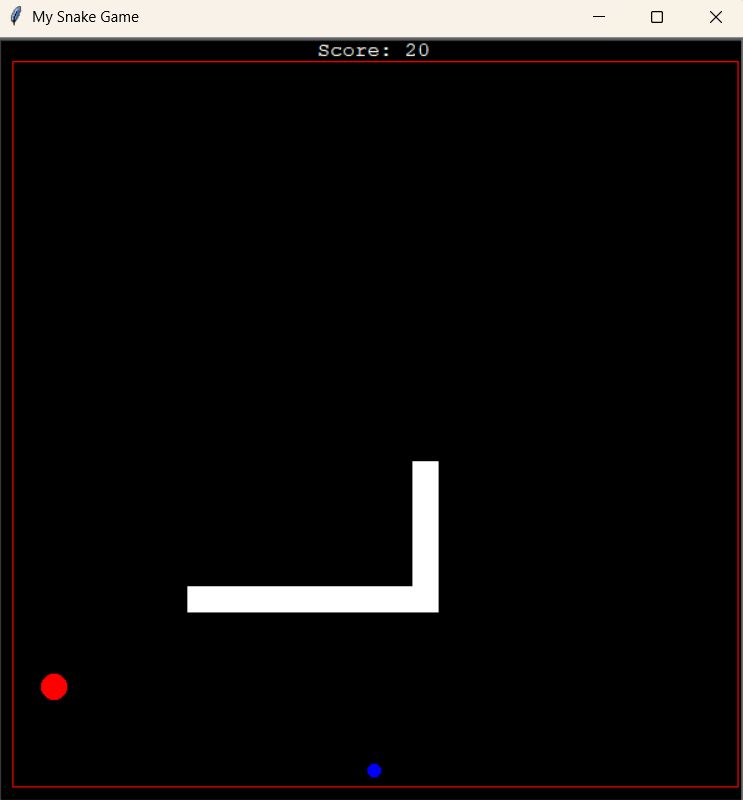
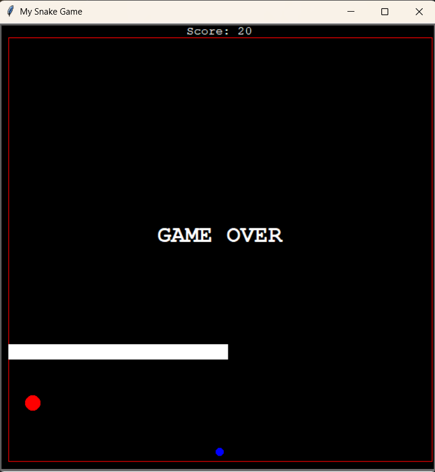

# Snake Game

This is a classic Snake Game implemented in Python using the `turtle` module.

## Features
- Move the snake using arrow keys.
- Eat food to grow the snake and increase the score.
- Boundary detection to end the game upon collision.
- Scoreboard to track the player's progress.
- Additional "Big Food" mechanics (currently commented out in the code).

## Installation
1. Ensure you have Python installed (Python 3 recommended).
2. Clone or download this repository.
3. Install required dependencies (if any, though `turtle` is built-in for Python).

## How to Play
1. Run the `main.py` file.
2. Use the arrow keys (`Up`, `Down`, `Left`, `Right`) to control the snake.
3. Eat food (blue circles) to grow and score points.
4. Avoid hitting the boundaries and yourself to keep playing.
5. The game ends when the snake collides with the wall or its own body.

## File Structure
- `main.py`: Entry point of the game.
- `snake.py`: Manages the snake movement and growth.
- `food.py`: Handles food spawning mechanics.
- `bigfood.py`: Contains logic for a larger food item (commented out for now).
- `boundary.py`: Draws the boundary of the game.
- `scoreboard.py`: Manages the player's score display.

## Future Improvements
- Implement the `Big Food` feature properly.
- Add levels and increasing difficulty.
- Introduce power-ups or new mechanics.

## Screenshots

## License
This project is open-source and free to use. Feel free to modify and enhance it!

